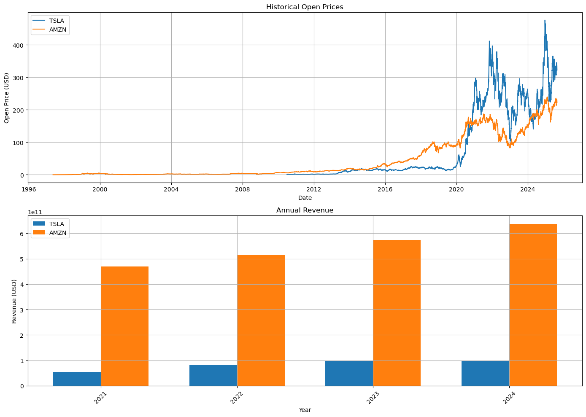

# 📊 Stock Market Data Analysis

## 🎯 Project Goal
For this project, I assumed the role of a **Data Analyst** at a startup investment firm that helps customers invest their money in stocks.  
The main objectives were:
- **Extract** financial data such as historical share prices and annual revenue reports using Python libraries.  
- **Analyze** popular stocks to identify long-term patterns and business trends.  
- **Visualize** the results in a dashboard to make stock performance more understandable for investors.  

This project focuses on two well-known companies:  
- **Tesla (TSLA)** – representing the fast-growing EV and technology sector.  
- **Amazon (AMZN)** – representing the e-commerce and cloud computing sector.  

By comparing both, the firm can better advise clients about growth opportunities and risks in these industries. 

---

## 🔧 Tools & Libraries Used
- [yfinance](https://pypi.org/project/yfinance/) → to extract stock data  
- [pandas](https://pandas.pydata.org/) → to manipulate and clean datasets  
- [matplotlib](https://matplotlib.org/) → to create visualizations  

---

## 📈 Extracting and Visualizing Stock Data

I used the `yfinance` library to pull stock data.  
The **`Ticker`** function creates a stock object by using the ticker symbol (TSLA for Tesla, AMZN for Amazon).  

### 1. Historical Stock Prices
Extracted with:

```python
hist = stock.history(period="max")
```

This gives stock information for the **maximum available time**.  

### 2. Annual Revenue Data
Extracted with:  

```python
financials = stock.financials.T
revenue = financials["Total Revenue"].dropna().sort_index()
```

This ensures only **Total Revenue** is used, cleaned from NaN values, and sorted by year.  

### 3. Dashboard with Matplotlib  
Two charts were created:  

- 📊 *Historical Open Prices Over Time* (line chart):  

```python
axes[0].plot(hist.index, hist["Open"], label=ticker)
```

- 💰 *Annual Revenue Comparison* (bar chart):  

```python
axes[1].bar(x, revenue.values, label=ticker)
```

Both charts include titles, axis labels, legends, and grid lines for clarity.  

---

## 📊 Visualizations
  

---

## 📝 Findings
### 1. Historical Stock Prices  
- **Amazon (AMZN)** shows a steady long-term growth trajectory, with notable accelerations after 2010.  
- **Tesla (TSLA)** experienced sharp growth starting around 2019, but with higher volatility.  

### 2. Annual Revenue  
- **Amazon** revenue consistently surpasses Tesla’s, reflecting global dominance.  
- **Tesla’s revenue** is smaller but growing fast, showing high potential.   

---

## 🧾 Conclusion  
- **Amazon** offers stability and long-term value for conservative investors.  
- **Tesla** offers higher growth potential but comes with higher volatility and risk.  
- A diversified portfolio could combine both: Amazon for stability and Tesla for growth.

---

## 🚀 How to Run
1. Clone this repository:
   ```bash
   git clone https://github.com/YuliaAsIs/Stock-Market-Data_Analysis.git
   cd stock-market-analysis
   ```
2. Install dependencies:
   ```bash
   pip install yfinance pandas matplotlib
   ```
3. Run the Python script in Jupyter Notebook or VS Code.

---


